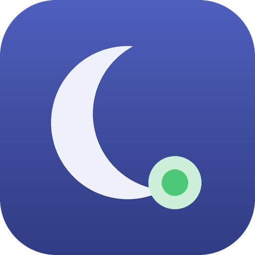

# Moon Jules — app



Panel de Android para ver el enjambre desde el móvil. Una pantalla, dos
ventanas de detalle. Uso personal, sin publicar.

Consume lo que Moon-Jules publica en Firebase RTDB. El contrato es
`../docs/SNAPSHOT.md` (esquema 3) y **no se negocia desde aquí**: si un
campo hace falta, se añade allí y se sube la versión del esquema.

## La frontera que importa

`lib/src/model/` es **Dart puro**, sin una sola importación de Flutter.
Ahí vive todo lo que puede equivocarse: parsear el snapshot, decidir si
el latido caducó, construir una orden con su caducidad. Se prueba sin
emulador y sin dispositivo:

```bash
cd app && flutter test
```

`lib/src/data/` es el pegamento con los SDK de Firebase, y es la única
capa que toca la red. Cuanto más fina sea, menos código queda sin
verificar.

## Tres reglas del contrato

**Una clave ausente no es un cero.** Firebase omite los valores nulos,
así que `silence_s` llega ausente cuando el reloj está congelado. Un
`?? 0` mostraría "muda hace 0 s" sobre trabajo ya entregado, que es
justo lo contrario de la verdad.

**Un esquema desconocido se rechaza**, no se interpreta a medias. Un
panel que muestra datos mal leídos es peor que uno que dice "no entiendo
esta versión".

**Designar es proponer.** La instancia elegida confirma escribiendo su
reclamación; hasta entonces la pantalla muestra deseado y real por
separado. Una designación sin recoger significa máquina dormida.

## Lo que la app no hace

No crea sesiones ni asigna tareas: eso lo resuelve una GitHub Action.
No archiva ni borra nada. Escribe exactamente dos nodos —`control/desired`
y `command`— y las reglas de seguridad lo imponen, no la buena conducta
de este código.

Y hay una alerta que **no puede venir de Moon-Jules**: la de instancia
caída. La máquina que se cayó es la que tendría que avisar. Esa la
detecta esta app comparando `heartbeat_ms` con `stale_after_s`.

## Puesta en marcha

```bash
flutter create --org org.ashware --project-name moonjules \
  --platforms android .
flutter pub get
flutterfire configure     # genera firebase_options.dart y google-services.json
flutter test              # 36 en verde
```

`firebase_options.dart` y `google-services.json` están en `.gitignore`:
llevan identificadores del proyecto de Firebase y no van al repositorio.

**`flutter create` sobrescribe `lib/main.dart` y crea
`test/widget_test.dart`.** Si vuelves a ejecutarlo, restaura el
`main.dart` de este repositorio y borra el `widget_test.dart` generado:
prueba un contador que no existe. En el canal `master`, además, la
plantilla usa sintaxis experimental (*dot-shorthands*) que no compila
con una restricción de SDK estable.

## Ejecutar

Las credenciales **no van en el código**: se inyectan al compilar, mismo
criterio que la ADR-004 del lado de Python.

```bash
flutter run \
  --dart-define=MJ_EMAIL=tu@correo \
  --dart-define=MJ_PASSWORD=tu-clave
```

**No sirve una cuenta anónima.** Las reglas exigen el UID del arquitecto
y el anónimo cambia en cada instalación, así que Firebase rechazaría
cada lectura. Usa la cuenta de correo creada en Firebase Authentication,
y comprueba que su UID sea el que aparece en `../docs/RTDB.md`.

Si te cansa teclearlo, `.vscode/launch.json` o un script local admiten
los mismos `--dart-define`; ninguno de los dos va al repositorio.

### En macOS

El *App Sandbox* bloquea la red saliente por defecto. Si RTDB no conecta
en escritorio, añade a `macos/Runner/DebugProfile.entitlements` y a
`Release.entitlements`:

```xml
<key>com.apple.security.network.client</key>
<true/>
```

`firebase_messaging` en macOS necesita además capacidades de push y un
perfil de Apple. Esta versión no las usa: solo mira.

## Por qué la lista se ve así

Cada fila cabe en dos líneas. Con nueve sesiones en problema, un título
de dos líneas empuja el motivo fuera de pantalla y obliga a desplazarse
para leer poco.

El tiempo va dentro del subtítulo y **etiquetado**: `muda 52 min` o
`abierta 103 d`. Muda y abierta son preguntas distintas —una sesión
puede llevar tres horas abierta y treinta segundos muda— y en una
columna sin nombre pasarían por lo mismo. Las fallidas no tienen tiempo
de silencio, porque su reloj está congelado; ahí se muestra la edad, que
sí se conoce.

## Lo que la app sí escribe

Un solo campo: `control/desired`, al designar qué instancia vigila. Y es
**una propuesta, no una orden cumplida**: la instancia elegida confirma
en su siguiente ciclo escribiendo su reclamación, y la pantalla muestra
las dos cosas.

Designar vive aquí y no en la CLI porque las reglas lo reservan al
arquitecto: **una máquina no puede autodesignarse**. Y porque el momento
de necesitarlo es justo cuando una máquina cayó y tú estás en otro sitio.

**Solo se ofrece designar a las que están publicando.** Un botón que
falla al pulsarlo es una acción fallida que la interfaz permitió; el
motivo va en el subtítulo, para que el botón apagado no quede mudo. Y
Firebase lo valida además por su cuenta: que la app no lo ofrezca está
bien, que no pueda aunque tenga un fallo es mejor.

## Sin conexión

El SDK de RTDB sirve de **caché**: sin red sigue entregando el último
snapshot conocido, con latidos de hace horas. Sin distinguirlo, la
pantalla acusaría a las tres máquinas de haber muerto a la vez cuando lo
que pasa es que el móvil está en un ascensor — el mismo engaño que
motiva el proyecto entero, una capa más arriba.

`.info/connected` lo resuelve: es estado local del SDK, no viaja por la
red y responde al instante. Sin conexión, la app avisa arriba, dice de
cuándo son los datos y no atribuye ningún silencio a las máquinas.

El reloj también se corrige. La caducidad del latido se calcula contra
la hora del teléfono, así que uno cinco minutos adelantado daría por
caídas máquinas que publican cada cinco. `.info/serverTimeOffset` da la
diferencia y se aplica antes de comparar.

## Avisos push

La app registra su token en `{root}/devices/{token}` al abrirse y sigue
sus rotaciones: **un token viejo deja de recibir sin avisar de nada**,
que es justo el modo de fallo que este proyecto existe para no repetir.

Moon-Jules envía por FCM con la misma cuenta de servicio que publica el
snapshot, así que basta con `fcm = true` en `[notify]` del lado del Mac.

Dos cosas que conviene saber. Con la app **en primer plano** el sistema
no muestra notificación: estás mirando la pantalla, así que el aviso
sería redundante. Y la alerta de instancia caída **no llega por push**
—la máquina que se cayó no puede enviarla—; esa la calcula la propia app
comparando `heartbeat_ms` con `stale_after_s`.

Si el registro falla, la pantalla lo dice arriba: sin push, solo verías
las alertas con la app abierta.

## Lo que falta

Los botones que tocan Jules —desatascar, silenciar, pausar—. Se dejaron
fuera a propósito: la capacidad de actuar sobre el enjambre desde el
bolsillo se gana, no se asume. El canal de comandos ya existe en ambos
lados y está probado; falta solo la interfaz.
